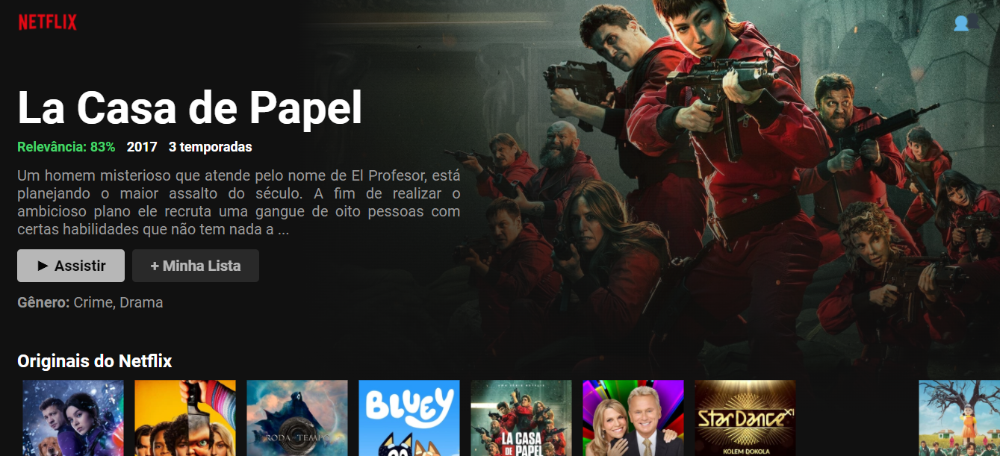

# Projeto Site Netflix(Clone)

- Objetivo: Fazer uma cópia fiel do site Netflix. Puxando dados de uma API do site themoviedb.org. 

> Tecnologias usadas:

- ReactJs
- JavaScript
- HTML5
- CSS3
- ContextAPI